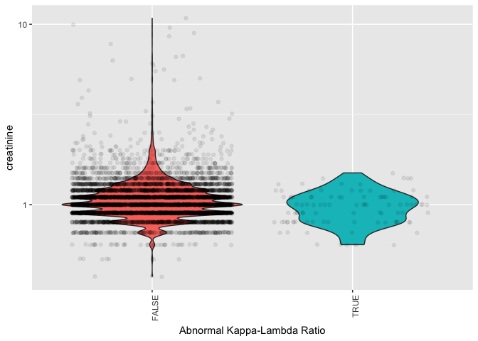

Stat545 Homework 3
================
Eric Sanders
Submitted for 2018-10-02


In this document we present some data exploration completed using the `flchain` dataset. We will use the packages `tidyverse`, `ggplot2`, `Hmisc` and `survival`.

``` r
library(Hmisc)
library(tidyverse)
library(ggplot2)
```

The sections of this document are as follows:

-   Loading in, Describing, and Observing the Data
-   Question 1: How do creatinine levels compare between people with a usual kappa-lambda ratio and people with extreme kappa-lambda ratios?
-   Question 2: What is the minimum, maximum, mean, etc. of creatinine level within each death classification?
-   Question 3: What is the minimum, maximum, mean, etc. of kappa-lambda ratio within each death classification?
-   Question 4: How do creatinine levels and kappa-lambda ratios relate?
-   Question 5: What percentage of people in each age bracket have abnormal kappa-lambda ratios?
-   Summary Statements

Loading in Data and Examining its Structure
===========================================

First, we load the data

``` r
# Call to preloaded data frame
data(flchain)
attach(flchain)
```

Next, we can look at some information on how this data set is organized.

``` r
# Determine what we can about the object flchain
str(flchain)
```

    ## 'data.frame':    7874 obs. of  11 variables:
    ##  $ age       : num  97 92 94 92 93 90 90 90 93 91 ...
    ##  $ sex       : Factor w/ 2 levels "F","M": 1 1 1 1 1 1 1 1 1 1 ...
    ##  $ sample.yr : num  1997 2000 1997 1996 1996 ...
    ##  $ kappa     : num  5.7 0.87 4.36 2.42 1.32 2.01 0.43 2.47 1.91 0.791 ...
    ##  $ lambda    : num  4.86 0.683 3.85 2.22 1.69 1.86 0.88 2.7 2.18 2.22 ...
    ##  $ flc.grp   : num  10 1 10 9 6 9 1 10 9 6 ...
    ##  $ creatinine: num  1.7 0.9 1.4 1 1.1 1 0.8 1.2 1.2 0.8 ...
    ##  $ mgus      : num  0 0 0 0 0 0 0 0 0 0 ...
    ##  $ futime    : int  85 1281 69 115 1039 1355 2851 372 3309 1326 ...
    ##  $ death     : num  1 1 1 1 1 1 1 1 1 1 ...
    ##  $ chapter   : Factor w/ 16 levels "Blood","Circulatory",..: 2 13 2 2 2 11 11 14 15 2 ...

And we can now see that `flchain` is of class 'data.frame' with 7874 rows and 11 columns. We have two variables that come defined as factors, `chapter` and `sex`, and the other nine variables come defined as either numeric or integer objects.

We will not be looking at `flc.grp`, `futime`, `mgus`, `sex`, or `sample.yr`. We can remove these columns to reduce clutter.

``` r
# Remove undesired columns
flchain = flchain %>%
  select(-flc.grp,-futime,-sample.yr,-mgus,-sex)
```

This data set is a random sample of subjects from a larger study that examined the relationship between serum free light chain levels and mortality. This data is freely available on R, and the parent study is published and accessible on NCBI, is entitled 'Prevalence and Risk of Progression of Light-Chain Monoclonal Gammopathy of Undetermined Significance (LC-MGUS): A newly defined entity', and is written by Angela Dispenzieri et. al.

In simplest terms, **light chains** are sub-units of antibodies, and there are two types, kappa and lambda. **Free** light chains are light chains that are not currently bonded to heavy chains to form an immunogloben antibody. Everyone always has some concentration of kappa and lambda free light chains in their blood serum. As a part of diagnosing patients as having warning signs of multiple myeloma (cancer of the white blood cells), doctors often look to identify if the ratio of free kappa light chains to free gamma light change is significantly different from usually observed ratios, because if one type of light chain is overly represented, this may indicate problems in antibody creation.

The last piece of needed background is that creatinine levels in blood serum tend to indicate kidney functionality, in that kidneys working well will keep creatinine levels in the blood low, since creatinine is a regular byproduct of body function.

With that background out of the way, we can look at what the variables in our data set represent.

-   **age**: A numerical value indicating age in years.
-   **kappa**: A numerical value representing kappa free light chain concentration in serum.
-   **lambda**: A numerical value representing lambda free light chain concentration in serum.
-   **creatinine**: A numerical value indicating creatinine levels in serum.
-   **death**: An indicator of if death occured by the last check in. 1=death, 0=no death.
-   **chapter**: If death occured, this indicates as a factor their primary cause of death according to the International Code of Diseases 9. If death did not occur, this is an NA.

First, we can specify the variables that can be stored as factors, but **weren't** when we called the data structure from R earlier.

``` r
flchain$death = as.factor(flchain$death)
```

Second, we can remove any rows from the data frame that aren't complete cases, but we must ignore any NA's in the `chapter` column, since these NA's are still part of an informative data row, just one where patients did not die. We select these rows as follows

``` r
# Instead of piping in the data to be filtered, pipe in the complicated set of TRUES and FALSES to filter by. Remove the chapter column, check for complete cases, then use THOSE trues and falses to filter the original data set that still has the chapter column.
flchain = flchain %>%
  select(-chapter) %>%
  complete.cases() %>%
  filter(.data=flchain)
```

We will define a new variable for our analysis based on the literature. As previously mentioned, the ratio of kappa free light chain serum concentration to lambda free light chain serum concentration is often used as a metric by doctors to preempt cancer development, so we will define a variable that is the ratio of the kappa variable to the lambda variable for use in our analysis, to match the literature.

``` r
# Replace kappa and lambda free light chain concentrations with a variable for their ratio
flchain = flchain %>%
  mutate(klratio = kappa/lambda) %>%
  select(-kappa,-lambda)
```

We've been removing some variables, removing some rows, and we defined a new variable, so let's double check the structure now so that we see everything is as it should be.

``` r
str(flchain)
```

    ## 'data.frame':    6524 obs. of  5 variables:
    ##  $ age       : num  97 92 94 92 93 90 90 90 93 91 ...
    ##  $ creatinine: num  1.7 0.9 1.4 1 1.1 1 0.8 1.2 1.2 0.8 ...
    ##  $ death     : Factor w/ 2 levels "0","1": 2 2 2 2 2 2 2 2 2 2 ...
    ##  $ chapter   : Factor w/ 16 levels "Blood","Circulatory",..: 2 13 2 2 2 11 11 14 15 2 ...
    ##  $ klratio   : num  1.173 1.274 1.132 1.09 0.781 ...

Next, we can summarize the numerical variabes in a table by calling the R functions `mean()`, `sd()`, `min()`, and `max()`

| Variable           | Mean  | S.D.  | Minimum | Maximum |
|--------------------|-------|-------|---------|---------|
| Age                | 65.06 | 10.68 | 50      | 101     |
| kappa-lambda ratio | 0.88  | 0.61  | 0.01    | 40.88   |
| creatinine         | 1.09  | 0.42  | 0.4     | 10.8    |

We can summarize the factors using simple R commands as follows

``` r
# Death event counts
flchain %>%
  group_by(death) %>%
  count()
```

    ## # A tibble: 2 x 2
    ## # Groups:   death [2]
    ##   death     n
    ##   <fct> <int>
    ## 1 0      4562
    ## 2 1      1962

``` r
# Counts for each death classification
flchain %>%
  group_by(chapter) %>%
  count()
```

    ## # A tibble: 17 x 2
    ## # Groups:   chapter [17]
    ##    chapter                  n
    ##    <fct>                <int>
    ##  1 Blood                    4
    ##  2 Circulatory            676
    ##  3 Congenital               3
    ##  4 Digestive               61
    ##  5 Endocrine               42
    ##  6 External Causes         57
    ##  7 Genitourinary           38
    ##  8 Ill Defined             36
    ##  9 Infectious              26
    ## 10 Injury and Poisoning    20
    ## 11 Mental                 131
    ## 12 Musculoskeletal         12
    ## 13 Neoplasms              509
    ## 14 Nervous                118
    ## 15 Respiratory            225
    ## 16 Skin                     4
    ## 17 <NA>                  4562

This offers a great deal of information, but not much of it has clear use to use before we start asking questions to answer. We will simply be able to refer to these distributions later as sanity checks that our plots match the distributions and ranges of our variables.

Question 1: How do creatinine levels compare between people with a usual kappa-lambda ratio and people with extreme kappa-lambda ratios?
========================================================================================================================================

According to the literature this data comes from, kappa-lambda ratios outside the range of 0.26-1.65 are considered abnormal and cause for concern. Let us define a new variable that we can group by for this comparison, and then summarize the creatinine levels by the groups we form.

``` r
# Form summary table after defining new variable for abnormal kappa-lambda ratio
flchain %>% 
  mutate(abn.kl = klratio <= 0.26 | klratio >=1.65) %>%
  group_by(abn.kl) %>%
  summarize(n(),mean=mean(creatinine),med=median(creatinine),min=min(creatinine),max=max(creatinine),sd=sd(creatinine))
```

    ## # A tibble: 2 x 7
    ##   abn.kl `n()`  mean   med   min   max    sd
    ##   <lgl>  <int> <dbl> <dbl> <dbl> <dbl> <dbl>
    ## 1 FALSE   6428 1.10      1   0.4  10.8 0.419
    ## 2 TRUE      96 0.978     1   0.6   1.5 0.203

We can complement these values in this table by creating a plot to visualize any difference we may see.

``` r
g = ggplot(mutate(flchain,abn.kl = klratio <= 0.26 | klratio >=1.65),aes(x=abn.kl,y=creatinine))
g + geom_violin(aes(fill=abn.kl)) + 
  geom_jitter(alpha=0.08) + 
  scale_y_log10() +
  theme(legend.position = 'none')+
  xlab("Abnormal Kappa-Lambda Ratio")+
  theme(axis.text.x = element_text(angle = 90, hjust = 1))
```



These plots make sense because we know that the sample size with abnormal kappa-lambda ratios is so much smaller, and that the means and medians were comparable but that the larger sample had a wider range. Thus, the plots and table appear to agree, and we remain uncertain of differences in creatinine levels, as there appears to be no clearly noticeable difference.

Question 2: What is the distribution of creatinine level within each death classification?
==========================================================================================

For this exploration, we will need to only look at the data for persons who have died.

``` r
fl.deaths = flchain %>%
  filter(complete.cases(flchain))
```

First we can create a table summarizing creatinine levels by death classification.

``` r
# Form creatinine summary table from death data grouped by death classification
fl.deaths %>% 
  group_by(chapter) %>%
  summarize(n(),ten.p.trim.mean=mean(creatinine,trim=0.1),med=median(creatinine),min=min(creatinine),max=max(creatinine),sd=sd(creatinine))
```

    ## # A tibble: 16 x 7
    ##    chapter              `n()` ten.p.trim.mean   med   min   max    sd
    ##    <fct>                <int>           <dbl> <dbl> <dbl> <dbl> <dbl>
    ##  1 Blood                    4           0.975  1.05   0.6   1.2 0.263
    ##  2 Circulatory            676           1.16   1.1    0.5   8.9 0.591
    ##  3 Congenital               3           4.13   1.3    1.1  10   5.08 
    ##  4 Digestive               61           1.21   1.2    0.6   5.9 0.743
    ##  5 Endocrine               42           1.18   1.2    0.7   6.1 0.808
    ##  6 External Causes         57           1.09   1.1    0.7   2.5 0.335
    ##  7 Genitourinary           38           1.47   1.2    0.8   6.3 1.08 
    ##  8 Ill Defined             36           1.04   1      0.5   1.4 0.194
    ##  9 Infectious              26           1.08   1      0.7   2   0.267
    ## 10 Injury and Poisoning    20           1.11   1      0.8   2   0.400
    ## 11 Mental                 131           1.06   1      0.6   2.8 0.288
    ## 12 Musculoskeletal         12           0.92   0.85   0.5   8.6 2.24 
    ## 13 Neoplasms              509           1.09   1.1    0.4   5   0.413
    ## 14 Nervous                118           1.03   1      0.4   1.9 0.261
    ## 15 Respiratory            225           1.07   1.1    0.4   7.8 0.554
    ## 16 Skin                     4           1.25   1.2    1     1.6 0.252

We see a variety of summary statistics for creatinine levels within each death classification. It is hard to interpret minimums and maximums from samples of different sizes, but we do see some different trimmed means (which only take the mean of the middle 80% of points). Let us plot this to observe these differences.

``` r
g = ggplot(fl.deaths,aes(x=chapter,y=creatinine))
g + geom_violin(aes(fill=chapter)) +
  geom_jitter(alpha=0.13) +
  scale_y_log10() + 
  theme(legend.position = 'none')+ 
  theme(axis.text.x = element_text(angle = 90, hjust = 1))
```


While we see higher means for congenital and musculoskeletal causes of death, we see especially in the plot that sample size for these two types is miniscule. The only death classification that has what looks like a notable increased mean in creatinine levels with a large enough sample size the merit attention is the genitourinary classification. This is exactly what we would expect, that a genitourinary cause of death may be related to a sign of kidney failure.

Question 3: What is the distribution of kappa-lambda ratio within each death classification?
============================================================================================

We will once again use the data only for patients who died.

First we can create a table summarizing the ratios by death classification.

``` r
# Form kappa-lambda summary table from death data grouped by death classification
fl.deaths %>% 
  group_by(chapter) %>%
  summarize(n(),ten.p.trim.mean=mean(klratio,trim=0.1),med=median(klratio),min=min(klratio),max=max(klratio),sd=sd(klratio))
```

    ## # A tibble: 16 x 7
    ##    chapter              `n()` ten.p.trim.mean   med   min   max     sd
    ##    <fct>                <int>           <dbl> <dbl> <dbl> <dbl>  <dbl>
    ##  1 Blood                    4           0.828 0.704 0.639 1.26  0.292 
    ##  2 Circulatory            676           0.903 0.884 0.213 2.58  0.289 
    ##  3 Congenital               3           0.775 0.890 0.466 0.967 0.270 
    ##  4 Digestive               61           0.933 0.911 0.318 1.98  0.321 
    ##  5 Endocrine               42           0.904 0.883 0.4   1.48  0.255 
    ##  6 External Causes         57           0.876 0.857 0.32  2.51  0.350 
    ##  7 Genitourinary           38           0.805 0.796 0.414 1.37  0.255 
    ##  8 Ill Defined             36           0.858 0.864 0.360 1.42  0.253 
    ##  9 Infectious              26           0.903 0.910 0.418 1.52  0.288 
    ## 10 Injury and Poisoning    20           0.886 0.889 0.395 2.54  0.487 
    ## 11 Mental                 131           0.916 0.892 0.423 2.68  0.342 
    ## 12 Musculoskeletal         12           0.888 0.907 0.573 1.19  0.189 
    ## 13 Neoplasms              509           0.854 0.847 0.220 1.61  0.259 
    ## 14 Nervous                118           0.929 0.940 0.269 1.54  0.240 
    ## 15 Respiratory            225           0.853 0.860 0.290 4.85  0.466 
    ## 16 Skin                     4           1.05  1.04  0.960 1.16  0.0885

We see a variety of summary statistics for creatinine levels within each death classification. Again, it is hard to interpret minimums and maximums from samples of different sizes, but we do see some different trimmed means (which only take the mean of the middle 80% of points). Let us plot this to observe these differences.

``` r
g = ggplot(fl.deaths,aes(x=chapter,y=klratio))
g + geom_violin(aes(fill=chapter)) +
  geom_jitter(alpha=0.13) + 
  theme(legend.position = 'none')+ 
  theme(axis.text.x = element_text(angle = 90, hjust = 1))
```


This plot does not offer much new information, and we don't make any strong conclusions. We are able to confirm that the plot matches the graph by looking at a selection of minimums and maximums and sample sizes, so the points all appear to have been placed properly. It may look as though there aren't extreme differences in kappa-lambda ratios betwween the death classifications observed in the study.

Question 4: How do creatinine levels and kappa-lambda ratios relate?
====================================================================

To try to summarize this in a table, we will discretize both creatinine levels and kappa-lambda ratios into 'low, medium, high' factors, and then make a table of the counts.

``` r
# Discretize creatinine levels and kappa lambda ratios to compare in a simple table
disc.flchain = flchain %>%
  arrange(creatinine,klratio) %>% # Order by creatinine before klratio because we will be manually taking creatinine levels in thirds, then sorting by klratio after.
  transmute(creatinine = factor(rep(c('low','med','high'),c(rep(round(length(creatinine)/3),2),round(length(creatinine)/3)-1)),levels=c('low','med','high')), # cut creatinine into 3 equal sized groups after sorting because of repetitions causing confusion and/or unequal groups when cutting
            klratio = cut2(klratio,g=3,m=length(klratio)/3)) # Use normal cutting for klratio because there is less repetition so the groups will be equal in size with less hassle

disc.flchain %>%
  xtabs(~creatinine+klratio,data=.)
```

    ##           klratio
    ## creatinine [0.0139, 0.736) [0.7355, 0.957) [0.9568,40.878]
    ##       low              920             683             572
    ##       med              748             832             595
    ##       high             508             660            1006

I was challenging myself to make this table in one piping sequence. It could have been simpler if I split it up, but I was enjoying the challenge in the code. I tried to heavily comment in case anyone wanted to examine each line. I wasn't able to give `klratio` the names 'low', 'med', 'high' in the piping sequence, so it's levels are the actual intervals that the cut function used to separate them.

We can visualize this table with a heatmap.

``` r
disc.flchain %>%
  table() %>% # See below for explanation for turning into table and data frame
  data.frame() %>%
  ggplot(aes(x=creatinine,y=klratio)) + 
  geom_tile(aes(fill=Freq),colour = "white") + 
  scale_fill_gradient(low = "white",high = "steelblue") +
  geom_text(aes(label=Freq))+
  ylim(rev(levels(disc.flchain$klratio)))
```


A neat trick I learned was that by turning a data frame that is two factor variables into a table and back into a data frame, you get a data frame that can make a perfect frequency heatmap, since there is now a frequency value for each pair of factor levels.

We see that the three darkest areas of the plot are the areas where the level of `klratio` agrees with the `creatinine` level. Thus, there appears to be some slight relation between the two.

Let us visualize this better by plotting the full undiscretized data.

``` r
g = ggplot(flchain,aes(x=log(klratio+1),y=log(creatinine+1)))
g + geom_point(alpha=0.3) +
  theme(legend.position = 'none')+ 
  theme(axis.text.x = element_text(angle = 90, hjust = 1))+
  geom_smooth(se=FALSE,colour='red',method='lm')
```


We see what appears to be a vague positive association between creatinine level and kappa lambda ratio. Note that the values of both variables got relatively close to 0, so a log(x+1) transformation was ideal, but I wasn't sure of a function to do this conveniently, so I had to manually do the transformation inside the `aes` function.

Question 5: What percentage of people in each age bracket have abnormal kappa-lambda ratios?
============================================================================================

This can be calculated and presented using `dplyr` functions

``` r
flchain %>%
  mutate(age = as.factor(cut(age,c(40,60,70,80,90,102))),
         abn.klratio = as.numeric(klratio <= 0.26 | klratio >=1.65)) %>%
  group_by(age) %>%
  dplyr::summarize(n(),mean(abn.klratio))
```

    ## # A tibble: 5 x 3
    ##   age      `n()` `mean(abn.klratio)`
    ##   <fct>    <int>               <dbl>
    ## 1 (40,60]   2636             0.0220 
    ## 2 (60,70]   1887             0.0143 
    ## 3 (70,80]   1352             0.00666
    ## 4 (80,90]    578             0.00346
    ## 5 (90,102]    71             0

It appears that abnormal kappa-lambda ratios became less frequent with age. This could be because people don't last with the condition to that age without developing the sickness and dying.

Summary Statements
==================

-   Creatinine levels did **not** have a visibly different distribution between people that did and did not have abnormal kappa-lambda ratios.
-   The only notable death classification to visibly have a different average creatinine level is genitourinary, which makes sense at it involves diseases of the kidneys. Trimmed means were calculated in each classification, alongside other summary statistics.
-   There were no clearly visible patterns in kappa-lambda ratio between levels of death classification, although trimmed means were calculated alongside other summary statistics.
-   Kappa-lambda levels and creatinine levels appear to slightly positively correlate, evidenced by a discretization of the data as well as a scatter plot. It is uncertain why higher kappa free light chains than lambda might be related to kidney disease.
-   The rate of abnormal kappa-lambda ratios decreases with age.
